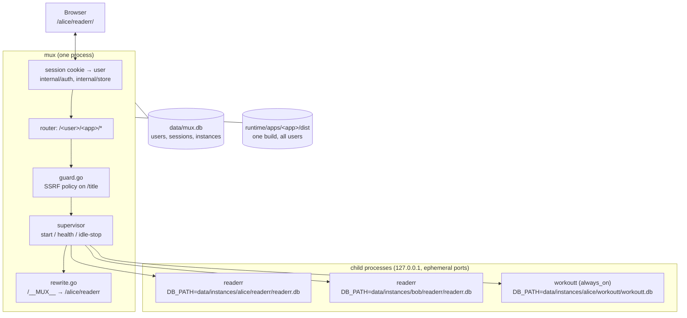

# Architecture

The multiplexer exists to answer one question: *how do you put a login in front
of an app that was designed, deliberately and correctly, to never have one?*

Every app it serves — [workoutt](../../../workoutt),
[readerr](../../../readerr), anything from
[local-sync-template](../../../local-sync-template) — is local-first. The
browser owns the data; the Go server is a sync target and a static file host.
There are no users, no sessions, and no row in any table that says who wrote it.
Adding all of that to each app is weeks of work per app, duplicated, and it
destroys the property that made them nice: you can delete the server and lose
nothing.

So this does not add auth to the apps. It runs **one whole copy of an app per
tenant** and authenticates in front of them.

## The big picture



Three invariants hold the design together:

1. **The apps do not know.** No app is modified, recompiled with gateway
   knowledge, or told which user it is serving. It reads `DB_PATH`, `PORT`,
   `STATIC_DIR` from its environment exactly as it always did.
2. **One build per app, not one per user.** The per-user prefix is applied at
   *serve* time, not build time, via a sentinel base path.
3. **Isolation is the process boundary and the file boundary.** Not a
   `WHERE user_id = ?`. There is no query in this system that could return
   another user's row, because there is no table that contains two users' rows.

## Why process-per-tenant

The obvious alternative — import each app as a library, run one process, and
route by user — is not available, and would not be better if it were.

**They are separate Go modules, and all of them are `package main`.** `readerr`,
`workoutt` and every generated app have their own `go.mod` and their own
`main()`. Making them importable means turning each into a library with an
exported constructor, which is a rewrite of every app plus a permanent coupling:
the gateway would have to be rebuilt and redeployed whenever any app changed.
Right now `muxbuild` compiles them as ordinary binaries and the gateway never
links against a single line of their code.

**Their configuration is process-global.** Every knob is `os.Getenv` read at
startup: `DB_PATH`, `PORT`, `STATIC_DIR`, plus `SEED`,
`NOTIFY_INTERVAL_SECONDS` and the VAPID keys in workoutt. There is no
`Config` struct threaded through handlers. In-process multi-tenancy would mean
making every one of those per-request, in three codebases, forever.

**Per-child environment is a real correctness win, not just a convenience.**
workoutt builds reminder instants in the *host* timezone. One process serving
users in Halifax and Vancouver would fire everyone's reminders in whichever zone
the server happens to be in. A child process per tenant gets its own `TZ`, and
the problem disappears without anybody writing timezone-handling code. The same
mechanism handles per-user `NOTIFY_INTERVAL_SECONDS`, or a future per-user
anything.

**The cost turned out to be small.** Measured cold start is ~111 ms against a
fresh database and ~55 ms warm; steady-state RSS is about 12 MB. That is cheap
enough that lazy starting is the right default — an instance spins up on the
first request after an idle stop and the user does not notice. The design would
be indefensible at 2 seconds and 400 MB; at 55 ms and 12 MB the isolation is
nearly free.

**And it fails safe.** A crashed child takes down one user's one app. A memory
leak is bounded by one process. An app that corrupts its database corrupts one
database. None of that is true of the shared-process design.

What it costs: memory scales with *active* tenants, not total ones (idle
timeouts are the whole capacity story); there is no cross-user anything, ever;
and stopping an idle instance is visible to anything the app was doing in the
background — which is exactly why `always_on` exists and why workoutt uses it.

## The sentinel base rewrite

The frontends are static Astro builds full of absolute URLs: `<script
src="/_astro/client.abc123.js">`, `<link href="/_astro/index.css">`, fetches for
lazily imported chunks, the service-worker registration path, the manifest.
Mounted at `/alice/readerr/`, every one of those is wrong.

The trick: build once with a base that is a **sentinel string nobody would ever
use**, then substitute at serve time.

```
astro build --base=/__MUX__      →   runtime/apps/readerr/dist/
                                      index.html: src="/__MUX__/_astro/…"
                                      BASE_URL:   "/__MUX__/"

GET /alice/readerr/              →   stream dist/index.html,
                                      replacing /__MUX__ with /alice/readerr
GET /bob/readerr/                →   same bytes, replacing with /bob/readerr
```

`internal/gateway/rewrite.go` does the substitution on HTML and JS responses;
`BasePlaceholder` in [apps.json](../../apps.json) declares the sentinel per app
(defaulting to `config.DefaultPlaceholder`, `/__MUX__`), and an empty value
disables rewriting entirely for apps whose assets are purely relative.

Why this beats the alternatives:

- **Per-user builds** (`astro build --base=/alice/readerr`) are correct and
  absurd: an Astro build of readerr emits ~250 fingerprinted chunks and takes
  tens of seconds. Multiply by users × apps, redo on every signup, and store N
  identical-except-for-a-string copies on disk. One build, one directory, any
  number of users is strictly better.
- **A `<base>` tag** only affects HTML-resolved URLs. It does not reach
  `import()` in a JS chunk, `fetch()` in application code, or anything the
  service worker computes from `self.location`. It also silently changes the
  resolution of every relative URL on the page, which breaks things far from
  where you edited.
- **Runtime path detection in the app** (`window.location.pathname.split('/')`)
  puts gateway knowledge inside the app, which is the thing this design refuses
  to do.
- **A subdomain per user** (`alice.example.com/readerr/`) removes the problem
  entirely and is genuinely the cleaner answer — at the cost of wildcard DNS, a
  wildcard TLS certificate, and a deployment story that no longer fits "run one
  binary on the laptop in the closet." Explicitly rejected for this project, not
  because it is wrong.

The sentinel is chosen to be unmistakable. `/__MUX__` appears in no library, no
CSS framework, and no plausible user content, so a blind string replacement over
built output has no false positives. This is why the placeholder is
configurable but should never be set to something ordinary.

One consequence worth internalising: **rewriting is a response-body
transformation on a proxied stream**, so it applies only to content types that
can contain the sentinel (HTML, JS, JSON manifests), and API responses are
explicitly exempt — see `APIPrefixes` below. An app that embeds its base in,
say, a compiled CSS `url()` would need that type added.

## Request lifecycle

Take `GET /alice/readerr/sync/pull?since=412`, with a valid session cookie for
`alice`.

1. **Session.** The cookie token is SHA-256'd and looked up
   (`store.SessionUser`), which joins on `credential_gen` and `is_disabled` in
   one query — so a password reset or a disabled account invalidates the session
   without a sweep. No session, and the request is a redirect to `/login`.
   Details in [auth.md](auth.md).
2. **Route.** The first segment is a username, the second an app name. Both are
   checked against `config.Reserved` at *config load* and *signup* time rather
   than per request, so this is a map lookup. The user must own the instance
   (`store.HasInstance`); owning it is what adding the app from the chooser
   does. `alice` requesting `/bob/readerr/` is a 404 — not a 403, which would
   confirm bob exists.
3. **Guard.** If the instance-relative path matches a `GuardedRoute` — readerr's
   `GET /title?url=` is the only one configured — the named query parameter is
   parsed as a URL and rejected under the `block-private` policy if it resolves
   to loopback, RFC1918, link-local or unique-local space. readerr's own
   `title.go` says outright that it has *"No SSRF hardening beyond the scheme
   check — consistent with the single-user LAN posture"*. That posture ended when
   the endpoint became reachable by anyone with an account, so the guard lives
   here, in the gateway, where the trust boundary actually moved.
4. **Instance.** The supervisor looks up the running child for
   (`alice`, `readerr`). If there is none it creates
   `data/instances/alice/readerr/` (0700), picks a free ephemeral port, and
   spawns `runtime/apps/readerr/readerr` with `DB_PATH`, `PORT`, `STATIC_DIR`,
   `TZ` and the app's configured `Env` — the first three always win over `Env`,
   so a config typo cannot point two users at one database. It then polls
   `HealthPath` (`/healthz`) until the child answers. ~111 ms cold.
5. **Proxy.** The `/alice/readerr` prefix is stripped and `/sync/pull?since=412`
   is forwarded to `127.0.0.1:<port>` — the app's routes are root-anchored, so
   this is exactly the URL it expects. `store.TouchInstance` records the use,
   which is what the idle timer reads.
6. **Response.** The path matches an `APIPrefix` (`/sync/`), so it is marked
   no-store and **exempted from rewriting** — an API response must never have
   its body rewritten, both because it cannot contain the sentinel and because
   scanning a large gzipped pull for a string is pure cost. A request for
   `/alice/readerr/` instead would hit the `dist/` static handler with the
   sentinel substitution applied.
7. **Idle.** With no request for `IdleTimeout` (30m for readerr), the supervisor
   stops the child: `SIGTERM`, wait, then kill. The database is closed cleanly;
   WAL mode recovers even if it is not. workoutt sets `always_on: true` and
   `idle_timeout: 0s` and is started at gateway boot, because its 60-second
   notification scheduler only fires while the process lives — an app that does
   background work cannot be lazily started, and that is a property of the app,
   declared in config, not something the gateway can infer.

### Where root-absolute requests go

Step 2 assumes the first path segment is a username. The apps break that
assumption: `getSyncUrl()` returns `''` when unset, so the client fetches
`/sync/pull`, with no user or app in it at all.

`internal/gateway/shim.go` recovers the context from `Referer`: a root-absolute
request whose path matches a configured `APIPrefix` and whose referring page is
under `/alice/readerr/` is re-attributed to that instance and rejoins the
lifecycle at step 3. This is the single reason the multiplexer works against
unmodified checkouts, and it is why `api_prefixes` in `apps.json` must list
every API route the app has — `/sync/`, `/healthz`, `/backup`, plus readerr's
`/title` and `/dbsize` and workoutt's `/push/`.

It is a heuristic. `Referer` is absent under `Referrer-Policy: no-referrer`,
stripped by privacy extensions, and unreliable from worker contexts. When it is
missing the request 404s. [patches/01-sync-base.md](../../patches/01-sync-base.md)
is the one-line upstream change that makes the client send the right URL in the
first place; it is offered, not applied.

## Layout

```
local-multiplexer/
├── apps.json              the only configuration; both commands read it
├── cmd/
│   ├── mux/               the gateway
│   └── muxbuild/          build orchestrator (go build + astro build --base)
├── internal/
│   ├── config/            apps.json schema, path resolution, reserved names
│   ├── store/             gateway database: users, sessions, instances, audit,
│   │                      settings, throttle (+ schema.sql)
│   ├── auth/              Argon2id + pepper, passphrases, session tokens
│   ├── gateway/           router, proxy, rewrite.go, shim.go, guard.go
│   └── supervisor/        child process lifecycle, health, idle stop
├── runtime/               build output (gitignored)
│   └── apps/<name>/{dist,<name>}
├── data/                  gitignored
│   ├── mux.db             identity
│   ├── pepper.key         0600, back up separately — losing it is terminal
│   └── instances/<user>/<app>/<app>.db
├── docs/
└── patches/               optional upstream changes, not applied
```

`internal/config` is the contract between the two commands: `muxbuild` uses
`FrontendSrc`/`BackendSrc`/`DistDir`/`BinaryPath` to know what to build and
where to put it, and `mux` uses the same functions to find it. Neither hardcodes
a path.

## Cross-cutting decisions

- **Dependencies: stdlib, `golang.org/x/crypto`, `modernc.org/sqlite`.
  Nothing else.** `modernc.org/sqlite` is pure Go, so there is no cgo and
  cross-compiling stays trivial. `x/crypto` is there for Argon2id, which is not
  in the standard library and is not something to implement.
- **`apps.json` is plain JSON with `DisallowUnknownFields`.** A typo is a
  startup error naming the field, not a silently ignored setting. JSON rather
  than YAML because the generator can emit a fragment without a YAML library —
  the cost is no comments in the file, which is why the commented example lives
  in [adding-an-app.md](adding-an-app.md) instead.
- **`Validate()` reports every problem, not the first.** A misconfigured file
  should take one restart to diagnose, not three.
- **Structured logging throughout** (`slog` with the default logger), because
  the interesting events here — instance started, instance idle-stopped, shim
  re-attributed a request, guard blocked a URL — are things you grep for by
  field, not read as prose.
- **The gateway store uses a single SQLite connection.** It is tiny and
  low-traffic, and one connection removes `SQLITE_BUSY` as a category. The same
  argument applies to the child databases; see
  [patches/05-hardening.md](../../patches/05-hardening.md).

## Where to look when…

| You want to… | Start at |
|---|---|
| add or reconfigure an app | [adding-an-app.md](adding-an-app.md), `apps.json`, `internal/config` |
| change how URLs are rewritten | `internal/gateway/rewrite.go`, `BasePlaceholder` |
| understand why a request 404s | `internal/gateway/shim.go` (`Referer`), then `api_prefixes` |
| change process lifecycle or env | `internal/supervisor`, `App.Env`/`IdleTimeout`/`AlwaysOn` |
| touch anything credential-shaped | [auth.md](auth.md), `internal/auth`, `internal/store` |
| block a new SSRF-shaped endpoint | `GuardedRoutes` in `apps.json`, `internal/gateway/guard.go` |
| operate the thing | [../admin/operations.md](../admin/operations.md) |
